# Call of Duty: Black Ops (Plutonium) — Zombies Autosplitter

**Author:** CButterfield27
**Date:** 09/01/2025
**Game:** Call of Duty: Black Ops (Zombies via Plutonium)
**Purpose:** Automatically control LiveSplit timing (start, split, pause/unpause, reset) based on in-game state.

---

## ✨ Features

* **Automatic Start**

  * Timer starts when entering gameplay (`menu_state == 0`) after the in-game timer passes a map-specific threshold.
  * Uses **normal thresholds** on fresh map loads.
  * Uses **fast thresholds** after a same-map restart (death or “Restart Level”).

* **Automatic Pause / Unpause**

  * Pauses LiveSplit when the game is paused (`game_paused = 1` for 3+ ticks).
  * Resumes after unpausing (`game_paused = 0` for 3+ ticks).
  * In **GT3 (Super EE) mode**, the timer stays paused during menu transitions and resumes only after **map change + fresh timer**.

* **Automatic Stop & Reset**

  * **On death (all GTs):** Pauses after 5 confirmed dead ticks.
  * **On fast restart (GT1/GT2):** Pause → “Restart Level” (pause menu `1 → 2`, timer near 0) triggers **immediate reset**. Next start uses **fast thresholds**.
  * **On full restart (Quit to menu → new map):**

    * **GT1/GT2:** Reset queued immediately in menu. Next start uses **normal thresholds**.
    * **GT3:** Timer remains paused until new map + fresh timer are detected.

* **GT1 Manual Round Splits**

  * Splits occur only when the current round matches a user-configured list.
  * Defaults: **2, 5, 10, 15, 20** (Round 2 acts as a sanity check).
  * Each round splits **only once per run**.
  * Round-split memory is **cleared** on new game, fast restarts, or full restarts.

---

## 🎮 Game Types (GT1–GT3) Explained

**GT1 — Rounds (single map, round-based splits)**
For traditional round PBs. The autosplitter **starts automatically**, **pauses/unpauses** with the in-game menu, **auto-resets** on death or restart, and **auto-splits** on the round numbers you configure.

* **Start:** Normal thresholds on a fresh load; **fast thresholds** after a death or same-map restart.
* **Splits:** Automatic on configured rounds only (e.g., `2, 5, 10, 15, 20`).
* **Death:** Pause → queue reset; next start uses **fast thresholds**.
* **Restart (same map):** Detects “Restart Level”; **immediate reset**, next start uses **fast thresholds**.
* **Full Restart (quit to menu → load map):** Queues reset in menu; next start uses **normal thresholds**.

**GT2 — EE (single-map Easter Egg, manual splits)**
For single-map Easter Egg runs where you split manually at your chosen steps. Behavior mirrors GT1 for start/pause/reset, but **no round auto-splits**.

* **Start:** Normal on fresh; **fast** after death/restart.
* **Splits:** **Manual only** (you control all splits).
* **Death / Restart rules:** Same as GT1 (auto-reset allowed).
* **Full Restart:** Queues reset in menu; next start uses **normal thresholds**.

**GT3 — Super EE (multi-map route, manual splits, strict resume)**
Designed for routes spanning **multiple maps**. The timer **never auto-resets**; instead it **pauses** through menus and only **resumes** when a **new map** is detected with a **fresh timer** and the player is **alive**. This prevents accidental resets between maps.

* **Start/Resume:** Requires **map change + fresh timer + alive**.
* **Splits:** **Manual only** (typically at map completions or major milestones).
* **Death:** **Pause** and wait; **no reset**.
* **Restart (same map):** Pause and wait for valid resume; **no reset**.
* **Full Restart (different map):** Resumes **only** once new map + fresh timer are detected.

### Quick Behavior Matrix

| Event / Rule                     | GT1 (Rounds)                                   | GT2 (EE)                                       | GT3 (Super EE)                                            |
| -------------------------------- | ---------------------------------------------- | ---------------------------------------------- | --------------------------------------------------------- |
| Start threshold after fresh load | **Normal**                                     | **Normal**                                     | Resume requires **map change + fresh timer**              |
| Start threshold after restart    | **Fast**                                       | **Fast**                                       | N/A (waits for map change + fresh timer)                  |
| Pause / Unpause                  | Debounced (3 ticks)                            | Debounced (3 ticks)                            | **Always pause** in menus; strict resume after map change |
| Death                            | Pause → **queue reset**                        | Pause → **queue reset**                        | **Pause only**, no reset                                  |
| Same-map “Restart Level”         | **Immediate reset** → next start uses **fast** | **Immediate reset** → next start uses **fast** | **Pause only**, no reset                                  |
| Full Restart (menu → new map)    | Reset queued; next start uses **normal**       | Reset queued; next start uses **normal**       | **Pause only**; resume on **map change + fresh timer**    |
| Splitting                        | **Auto** on configured rounds                  | **Manual**                                     | **Manual**                                                |

---

## 🔢 Memory Offsets

The script reads from the `plutonium-bootstrapper-win32` process:

| Variable       | Address      | Description                                                         |
| -------------- | ------------ | ------------------------------------------------------------------- |
| `menu_state`   | `0x7CB530`   | `0` = in gameplay, `99` = main menu (any `!= 0` is menu/loading)    |
| `timer`        | `0x168A37C`  | In-game timer (\~20 units/sec, resets near 0 on restart)            |
| `game_paused`  | `0x216BFD0`  | `0` = playing, `1` = paused, `2` = pause-menu action (Restart/Quit) |
| `game_round`   | `0x13C7DF60` | Current round number                                                |
| `dead`         | `0x1656C38`  | Alive/Dead codes (see below)                                        |
| `selected_map` | `0x899C38`   | Map ID, used for per-map thresholds                                 |

### Alive/Dead Codes

| Map        | Alive | Dead |
| ---------- | ----- | ---- |
| All others | 0     | 5    |
| Verrückt   | 7     | 25   |
| Der Riese  | 129   | 26   |

---

## ⚙️ User Settings

Edit these variables in the `init { ... }` section of the script before loading into LiveSplit.

```csharp
// --- Mode Selection ---
// 1 = Rounds (use manual round splits)
// 2 = EE (Easter Egg, single map, manual splits only)
// 3 = Super EE (multi-map route, manual splits with strict resume logic)
vars.Game_Type = 1;

// --- Fresh-timer heuristics ---
vars.T_RESET_SMALL = 100;        // Timer ≤ this value means "fresh start"
vars.T_RESET_CONFIRM_TICKS = 20; // Ticks required to confirm reset
vars.T_FAST_FRESH_PAD = 20;      // Cushion for detecting near-0 timer after fast restart

// --- Pause / Unpause debounce ---
vars.PauseConfirmTicks   = 3; // Ticks required to confirm pause
vars.UnpauseConfirmTicks = 3; // Ticks required to confirm unpause

// --- GT1 Manual Round Splits ---
// Choose which rounds will trigger automatic splits in GT1.
// Default placeholders:
vars.gt1_split_rounds = new List<int> { 2, 5, 10, 15, 20 };

// ✅ To add more rounds for GT1, just append them like this:
// vars.gt1_split_rounds.Add(25);
// vars.gt1_split_rounds.Add(30);
```

---

## 🔄 Timer & Reset Logic

### Start Conditions

* `menu_state == 0` (in gameplay)
* Player is **alive** (`dead` matches map’s alive code)
* `timer` is **increasing**
* `timer` ≥ **threshold** (normal or fast)

### Pause / Unpause

* **Pause:** `game_paused == 1` for ≥3 ticks → pause LiveSplit.
* **Unpause:** `game_paused == 0` for ≥3 ticks → resume LiveSplit (unless restart/death gating is active).
* **GT3:** Always pause on menu; resume only after valid map load (map change + fresh timer + alive).

### Stop & Reset

* **Death (all GTs):**

  * After 5 confirmed dead ticks → pause.
  * GT1/GT2: queue reset and use **fast thresholds** next start.
  * GT3: pause, wait for resume (no reset).

* **Fast Restart (same map):**

  * Detected by pause → `game_paused 1 → 2` (Restart Level).
  * GT1/GT2: reset once fresh timer near 0 is detected, then next start uses **fast thresholds**.
  * GT3: pauses and waits for resume without resetting.

* **Full Restart (Quit to menu → new map):**

  * Detected by pause → `game_paused 1 → 2` followed by `menu_state == 99`.
  * GT1/GT2: reset queued immediately in menu, next start uses **normal thresholds**.
  * GT3: pauses, requires **map change** and **fresh timer** before resuming.

### GT1 Round Splits

* On round increment (`current.game_round > old.game_round`):

  * If the new round is in `vars.gt1_split_rounds` **and** hasn’t split yet this run → split.
  * Each round number only splits **once per run**.
  * Round split memory resets on **new start, fast restart, or full restart**.

---

## 🚀 Installation & Usage

1. **Download** the file: [`B01 Auto Splitter (plutonium).asl`](B01%20Auto%20Splitter%20%28plutonium%29.asl)
2. Open **LiveSplit** → *Edit Layout* → **Add** → *Control* → **Scriptable Auto Splitter** → load the `.asl` file.
3. Open the `.asl` file in a text editor and configure your settings (see [User Settings](#-user-settings)).
4. Launch **Plutonium BO1**.
5. Start your LiveSplit timer. The script will:

   * Auto-start at the correct in-game time threshold
   * Pause/resume with the in-game pause menu
   * Reset on death or restart (GT1/GT2)
   * Handle full restarts correctly (normal thresholds after menu quit)
   * Auto-split on your chosen rounds (GT1)

---

## 🔄 State Machine Overview

```mermaid
stateDiagram-v2
    [*] --> Idle

    state Idle {
      [*] --> WaitingStart
      WaitingStart --> Running : In-game & alive & timer ≥ threshold
    }

    Running --> Paused : game_paused stable = 1
    Paused --> Running : game_paused stable = 0 AND gates clear

    Running --> Stopped : Death (dead stable)
    Running --> MenuExit : Leave gameplay while unpaused
    Paused --> MenuActionArmed : game_paused 1 → 2
    MenuActionArmed --> FullMenu : menu_state == 99
    MenuExit --> Resetting
    FullMenu --> Resetting : GT1/GT2 (full restart)

    Resetting --> WaitingStart

    Paused --> ResumeCheck : GT3 manual split/death
    ResumeCheck --> Running : map change (if required) & fresh timer & alive
    ResumeCheck --> [*] : Reset (GT1/GT2 fast restart)
```



---

## ℹ️ Notes

* Offsets are **for Plutonium BO1 only** — they may need updating if the client changes.
* **GT1** → round-based, splits at configured rounds.
* **GT2** → Easter Egg runs, splits manually, resets on death/restart.
* **GT3** → Super EE (multi-map), splits manually on map completion, no auto-reset.
* Round-split memory is always cleared after a **reset, fast restart, or full restart**.
* Designed to prevent false starts/resumes with debounce and stability checks.
